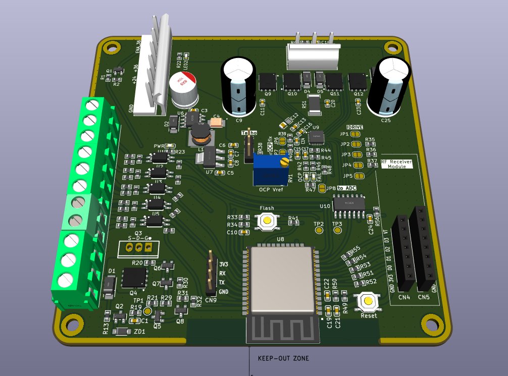

# garage-door-controller
Garage door controller with integrated motor driver 24V/36V, 7A

Features:
- DRV8701 driver
   - selectable mosfet gate drive
   - and overcurrent protection
- PowerSO mosfets
  - shall be enough to run 24V/7A and more
- External interface for common RF-receivers
  - RX-480R / RF11A04 
  - HCS301 based
- Fabrication
  - Prepared for automated assembly on JLCPCB
  - Most of components are basic, no unnesessary Pick-and-place feeding fees. I personally order only couple of Extended parts to be soldered.

# under construction

# BOM

[Interactive BOM](bom/ibom.html)